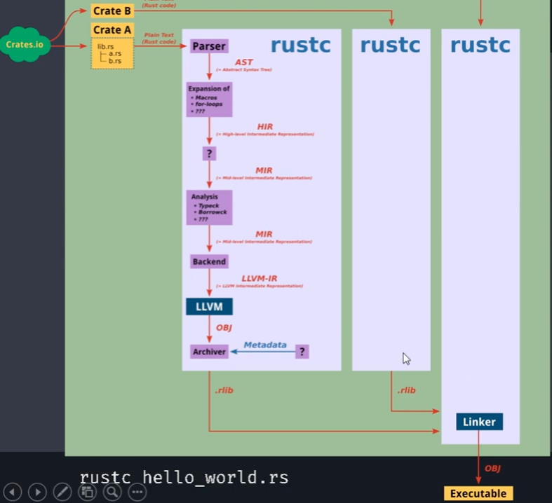

#### 2.1. Rust compoiler details

```bash
$ cd hello_rust
```

#### rust compailer 'Derleme' aşaması
```bash
{
  # 01 Ayrıştırma
    > rustc -Z unpretty=normal hello_rust.rs

    # 02 Macro ve Sözdizimleriner Uzaltılması
      > rustc -Z unpretty=expanded hello_rust.rs

      # 03 Tür Oluşturma
        > rustc -Z unpretty=hir,typed hello_rust.rs

        # 04 Mid-level
          > rustc -Z unpretty=mir hello_rust.rs

          # 05 LLVM IR
            > rustc -Z unpretty=llvm-ir hello_rust.rs

            # 06 ASM Dosyası (Makine Kodu)
              > rustc -emit asm hello_rust.rs
}
```

#### Tüm aşamaları görmek için
```bash
$ rustc -Z time-passes hello_rust.rs
```

Obj linker ile bağlanarak 'çalıştırılabilir' dosya elde edilir.



#### rust nightly versiyonuna geçiş
```bash
$ rustup override set nightly
```

#### emit ile .ll dosyası oluşturma
```bash
$ rustc --emit llvm-ir hello_rust.rs

$ cat hello_rust.ll
```

#### emit ile .s dosyası oluşturma (assembly çıktısı)
```bash
$ rustc --emit llvm-ir hello_rust.rs

$ cat hello_rust.ll
```

#### emit ile .ll dosyası oluşturma
```bash
$ rustc --emit asm hello_rust.rs

$ cat hello_rust.s
```

##### Kaynaklar
https://www.youtube.com/watch?v=Cr1KmCExxmM&list=PLgvWD2scL860_6ppZQS6i86vQuX_5wV2-&index=5
