# 4. Variables

```rust
  let age = 30;

  // let: anatar kelime
  // age: degisken adi
  // 30: degisken degeri
```

```rust
  let age : u8 = 3

  // : : degisken tipi (tür belirteci), u8: unsigned 8 bit integer
```

# Mutable & Constansts Variables

```rust
  let mut age = 30;
  age = 31;
```

```rust
  const PI: f32 = 3.14;
```

# Veri Tipleri

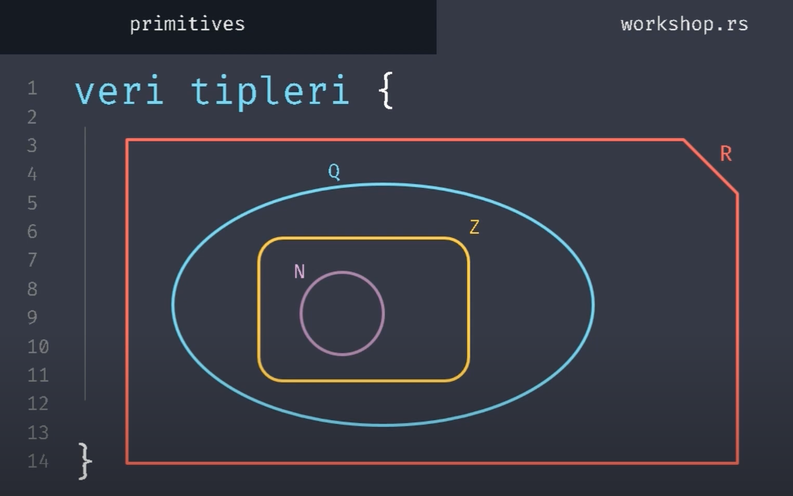

# Integers

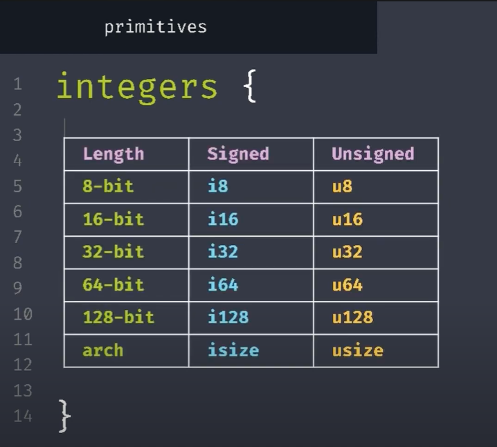

# Boolean

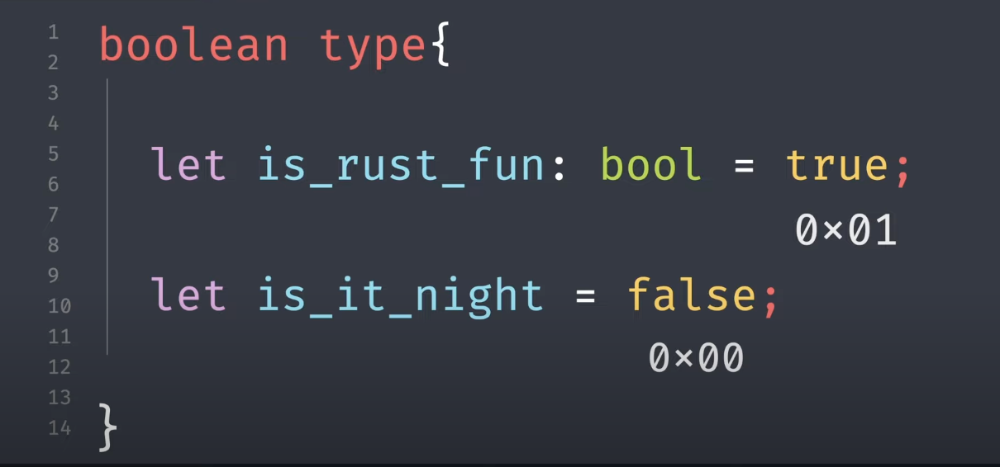

# Floats

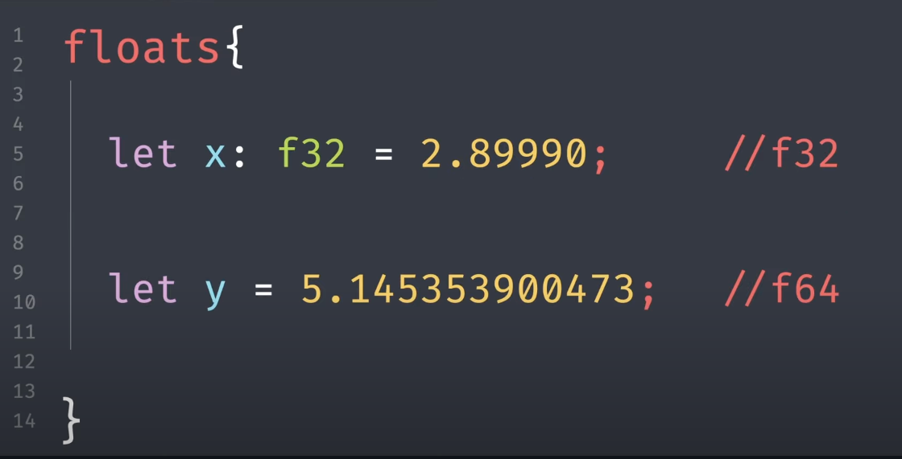

# Chars

```rust
  // Rust'ta char 4 byte'tır.
  let a = 'a';
  let c: chart = 'z';
  let face = '😃';
  let rust = '🦀';

  println!("ferris: {}", rust);
```

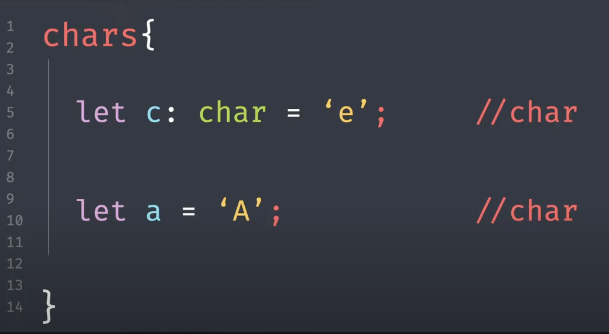


# Arrays

```rust
  let numbers = [1, 2, 3, 4, 5];
  println!("numbers: {:?}", numbers);
  // numbers: [1, 2, 3, 4, 5]

  let numbers: [char; 5] = ['a', 'b', 'c', 'd', 'e'];
  println!("numbers: {:?}", numbers);
  // numbers: ['a', 'b', 'c', 'd', 'e']f

  let numbers = [1; 5];
  println!("numbers: {:?}", numbers);
  // numbers: [1, 1, 1, 1, 1]
```

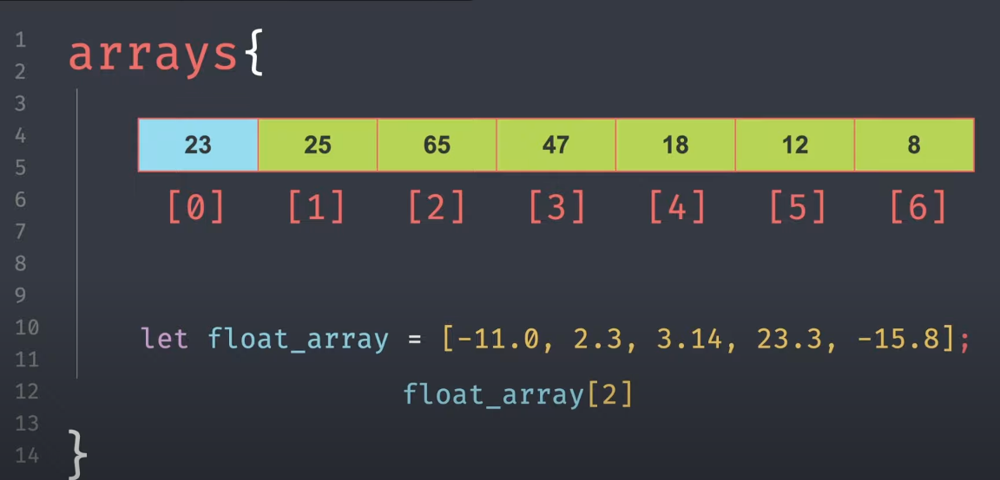

# Tuples (Demetler)

```rust
  let person: (&str, &str, i8, (str, char)) = ("Ahmet", "Sarıdoğan", 27, ('Erkek', 'E'));
  println!("{} is {} and {}", person.0, person.1, person.3.0);
  // Ahmet is Sarıdoğan and Erkek
```

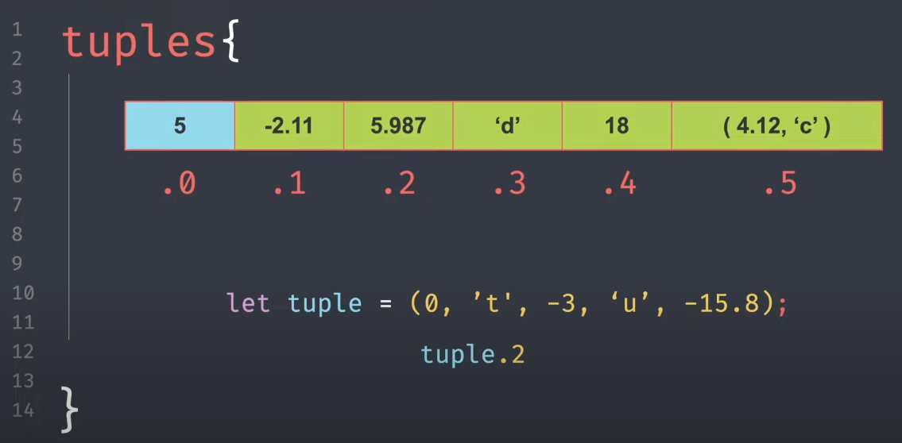

# &str(string literal) ve String

```rust
  // Unmutable String
  let name: &str = "Ahmet";
  let surname: %'static str = "Sarıdoğan";
  let company: String = "Epicoeni".to_string();

  // Mutable String
  let mut title = String::from("Software Engineer");

  // push string
  let mut work: String = String::new();
  work.push_str(string: company.as_str());
  work.push_str(string: " - ");
  work.push_str(string: title.as_str());
  // Epicoeni - Software Engineer

```

# String Slices

```rust
  let name = "Ahmet";
  let surname = "Sarıdoğan";

  let fullname = format!("{} {}", name, surname);
  println!("fullname: {}", fullname);
  // fullname: Ahmet Sarıdoğan

  let fullname = &fullname[..];
  println!("fullname: {}", fullname);
  // fullname: Ahmet Sarıdoğan

  let fullname = &fullname[0..5];
  println!("fullname: {}", fullname);
  // fullname: Ahmet

  let fullname = &fullname[6..];
  println!("fullname: {}", fullname);
  // fullname: Sarıdoğan
```
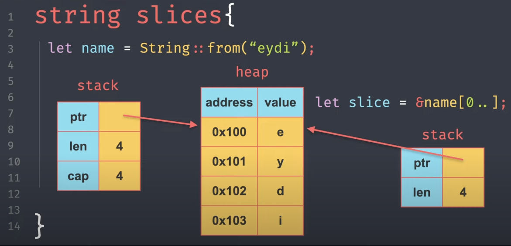


Kaynaklar: https://www.youtube.com/watch?v=A-jWEtmWzgE&list=PLgvWD2scL860_6ppZQS6i86vQuX_5wV2-&index=27

# Raw String Literals

```rust
  let message: &str = "Hello World Ahmet\"s";
  println!("message: {}", message);
  // message: Hello World Ahmet"s

  let message: &str = r#"Hello World Ahmet"s"#;
  println!("message: {}", message);
  // message: Hello World Ahmet"s

  let message: &str = r##"Hello World #Ahmet"s"##;
  println!("message: {}", message);
  // message: Hello World #Ahmet"s"

  let user: &str = r#"
    {
      "name": "Ahmet",
      "surname": "Sarıdoğan"
    }"#;

  let query: &str = r#"
    SELECT *
    FROM users
    WHERE name = "Ahmet"
    AND surname = "Sarıdoğan"#;
```

# Tür Dönüşüm Operatörü | as

```rust
  let a: f32 = 2.33;
  let b: u32 = 3;

  let c = a as u32 + b;
  println!("c: {}", c);
  // c: 5
```

## Unsigned & Signed Integers
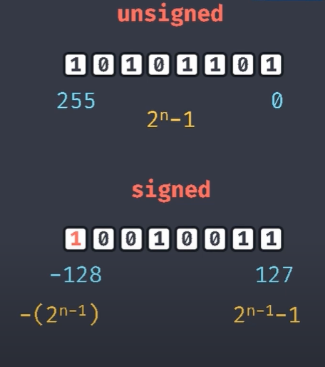

# Why use should data types?
Peki neden unsigned-signed durumu var? Maliyeti düşükmek için
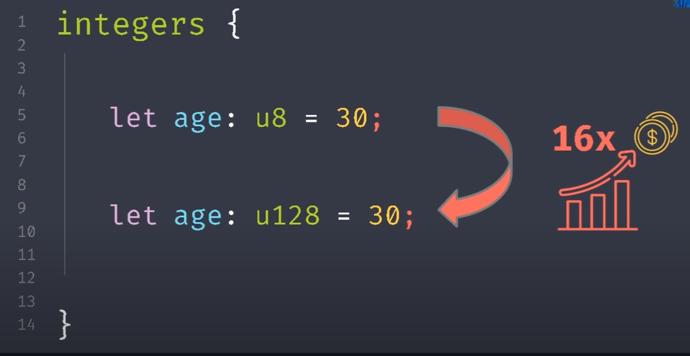

# Stack (Yığın)
Verilerin bellekte tutulma şekli.

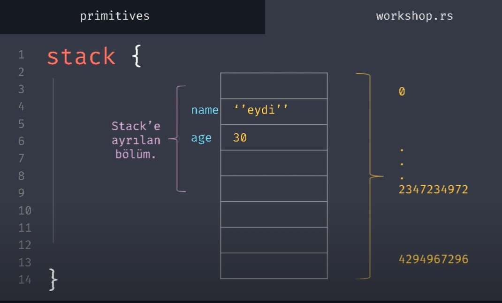

# Variable Definition

```rust
let _age = 30;
let aget_30 = 30;

// Bu şekilde başlayamaz
let ag€ = 30;
let 30_age = 30;
```

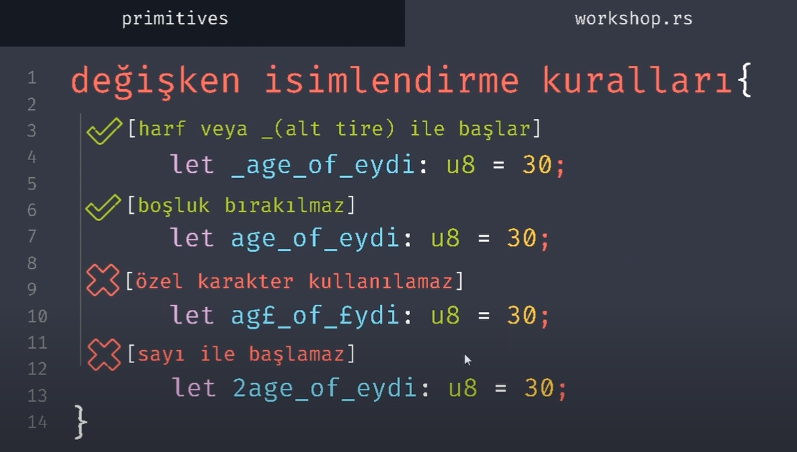

# Variable Definition Types

```rust
// camelCase
let camelCase: u8 = 30;

// PascalCase
let PascalCase: u8 = 30;

// snake_case (Rust için tercih edilen)
let snake_case: u8 = 30;

// SCREAMING_SNAKE_CASE
let SCREAMING_SNAKE_CASE: u8 = 30;

// kebab-case
let kebab-case: u8 = 30;
```

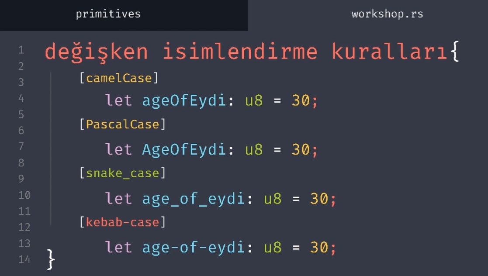


Kaynaklar:
https://www.youtube.com/watch?v=CCdkFdnx0-A&list=PLgvWD2scL860_6ppZQS6i86vQuX_5wV2-&index=8
